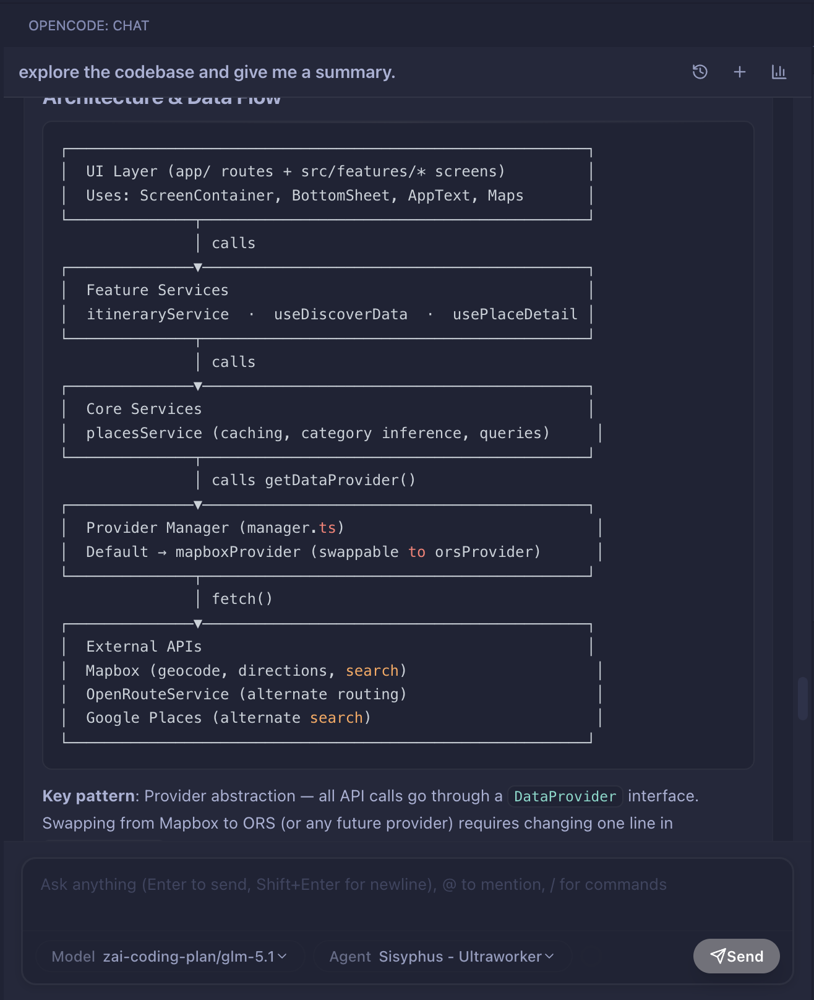
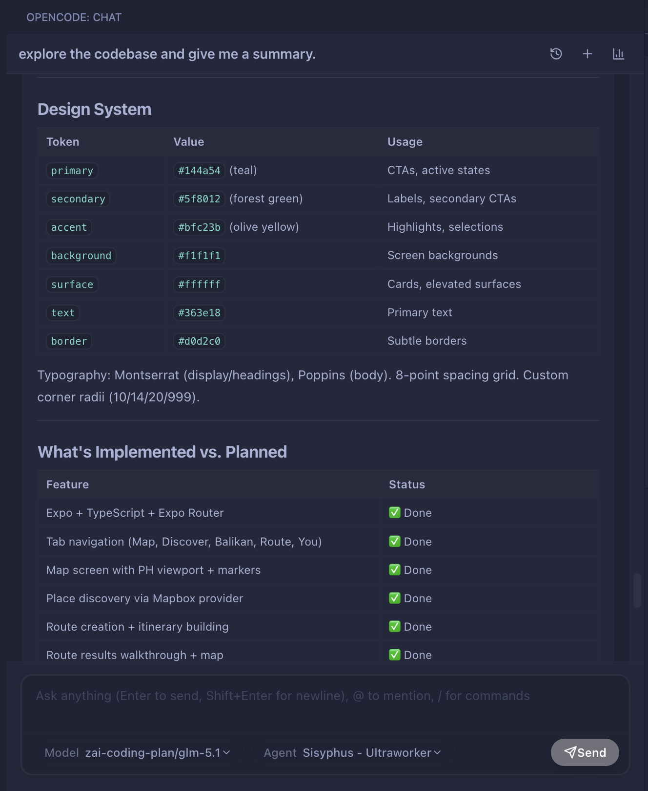
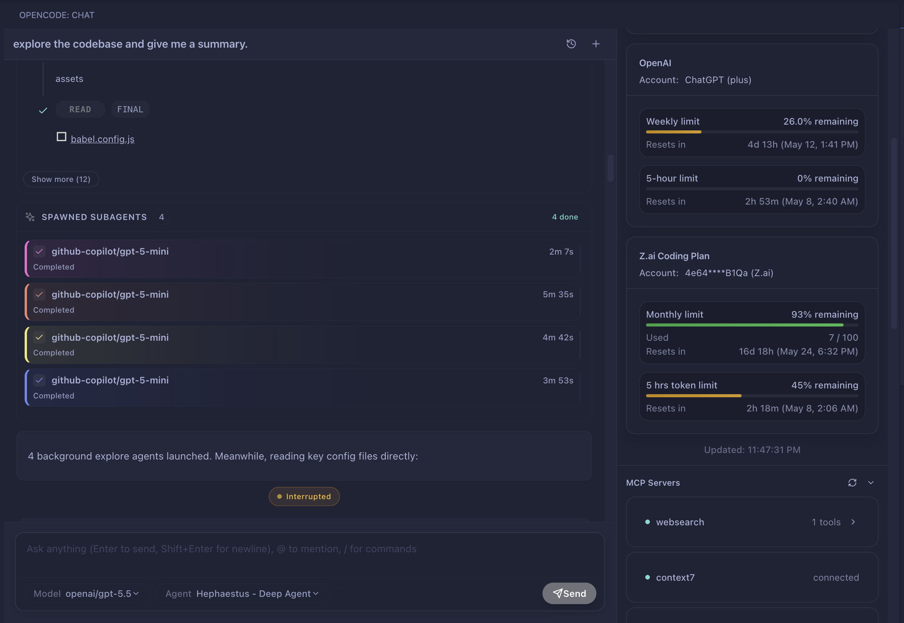
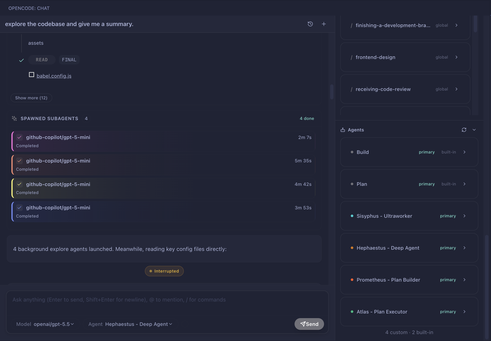
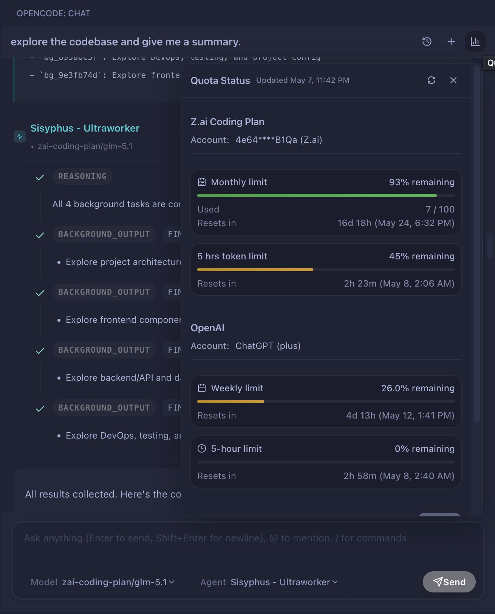
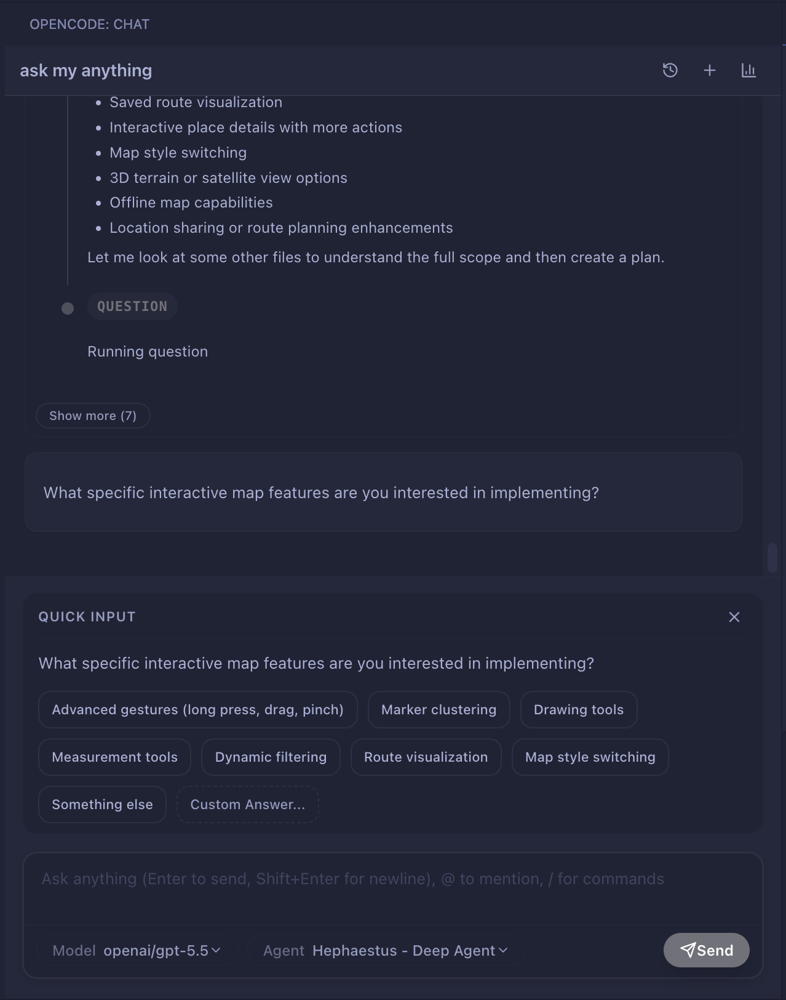

# OpenCode VS Code Extension

Bring [OpenCode](https://opencode.ai) into VS Code with a dedicated chat panel, implementation planning, live streaming, subagent tracking, quota visibility, and persistent sessions.

Requires the [OpenCode CLI](https://github.com/anomalyco/opencode) to be installed locally.

---

> [!IMPORTANT]
> **Disclaimer:** This extension is an independent personal project and is **not affiliated with, endorsed by, or maintained by OpenCode or its creators**.

## Why Install This

If you already use OpenCode in the terminal, this extension gives you a more integrated VS Code workflow:

- Chat with OpenCode in a dedicated sidebar instead of juggling terminal sessions
- Generate and review `implementation_plan.md` files before code changes
- Track subagents, quotas, MCP status, LSP status, and session stats in one UI
- Keep persistent session history inside VS Code
- Use file references, image attachments, slash-command skills, and quick session controls without leaving the editor

## Quick Start

1. Install the [OpenCode CLI](https://github.com/anomalyco/opencode):
   ```bash
   curl -fsSL https://opencode.ai/install | bash
   ```
2. Connect at least one provider in OpenCode:
   ```bash
   opencode
   /connect
   ```
3. Install this extension in VS Code.
4. Open the chat with `OpenCode: Focus Chat`.

## Screenshots & GIFs

### Demo GIF


### Conversation View





### Extended Panels




### Quota + Questions




## Table of Contents

- [Why Install This](#why-install-this)
- [Quick Start](#quick-start)
- [Overview](#overview)
- [Features](#features)
- [Screenshots & GIFs](#screenshots--gifs)
- [Architecture](#architecture)
- [Prerequisites](#prerequisites)
- [Installation](#installation)
- [Development](#development)
- [Usage](#usage)
- [Keyboard Shortcuts](#keyboard-shortcuts)
- [Configuration](#configuration)
- [Project Structure](#project-structure)
- [Core Services](#core-services)
- [Webview (React UI)](#webview-react-ui)
- [Logging](#logging)
- [Testing](#testing)
- [Contributing](#contributing)

---

## Overview

This extension adds a VS Code-native interface on top of the local OpenCode runtime. It talks to the OpenCode server through `@opencode-ai/sdk`, streams activity over SSE, and renders the chat experience in a React webview.

It is built for people who want OpenCode’s agent workflow without leaving the editor.

What it adds beyond a terminal-only setup:

- **Implementation Plan workflow** — AI generates a structured `implementation_plan.md` before touching any code; plans are parsed and rendered interactively
- **Subagent orchestration UI** — background tasks are tracked, rendered inline as cards, and inspectable in a detail modal
- **Per-session quota & budget monitoring** — surfaces provider-reported usage, limits, and daily budget signals across OpenAI, GitHub Copilot, Google Gemini, Zhipu, Z.ai, and other providers
- **Extended right panel** — live MCP server status, LSP server status, installed skills, and agent roster always visible on wide screens

---

## Features

### AI Chat

- Full streaming chat with real-time token counting (prompt / response / reasoning / cache read-write)
- Markdown rendering with syntax highlighting via `highlight.js`
- Thinking/reasoning bubble display with collapsible sections
- Copy message content to clipboard
- Image attachments and inline image preview modal
- Contiguous message grouping for visual clarity
- Unified error cards for API failures, timeouts, and structured-output compatibility issues

### Implementation Planning

- Switch to **Plan** agent to generate an `implementation_plan.md` before any code changes
- "View Implementation Plan" button appears on every AI response that generated a plan
- Dedicated plan viewer (`PlanViewProvider`) with interactive checklist tracking
- Plan can be commented on, revised, and then executed
- Interactive review loop for revising a plan before execution

### Agents & Skills

- Agent selector (Build, Plan, and any plugin agents registered via `app.agents()`)
- Per-message agent name badge with the agent's configured color
- **Skills** (`/command`) panel in the right sidebar listing all slash-command skills from the server

### Subagent Orchestration

- Background tasks ("subagents") are tracked via `SubagentTracker`
- Active task panel with live status dots and step progress
- Expandable subagent detail modal with full timeline, thinking events, and tool calls
- Subagent cards rendered inline inside assistant messages

### Interactive Q&A Flow

- Supports interactive question/answer exchanges inside the chat timeline
- Handles multiple interaction types (question, quick actions, confirm) with inline response controls
- Preserves interactive context across session hydration/reload

### Session Management

- Persistent chat history across VS Code restarts (stored in `globalState`)
- Session list sidebar with rename, delete, and fork support
- Session compaction support (large histories are summarized server-side)
- VCS diff review panel (`DiffReviewProvider`) — inspects changes made in a session

### Quota & Budget Monitoring

- Real-time quota data fetched from provider APIs (OpenAI, Copilot, Gemini, Zhipu, ZAI)
- `QuotaMonitor` panel in the right sidebar with usage bars and projected monthly consumption
- `RequestBudgeter` calculates a daily request allowance to last the full billing month
- Configurable warning thresholds and optional hard enforcement

### Plugin Ecosystem Support

- Works with OpenCode plugin-driven workflows (including community plugin collections like **Oh My OpenCode**)
- Surfaces plugin-provided agents, skills, and capabilities directly in the extension UI

### Extended Right Panel (Desktop ≥ 1100 px)

- **Active Task Panel** — current subagent progress
- **Quota Monitor** — provider quota and budget
- **Todo Panel** — session-scoped todo items surfaced from AI
- **MCP Servers** — live status of all Model Context Protocol servers with per-server tool lists
- **LSP Servers** — Language Server Protocol status
- **Skills** — slash-command catalog from `client.command.list()`
- **Agents** — all agents from `client.app.agents()` with mode badge, color dot, and description

### Streaming & Reliability

- Fetch-based SSE client (not `EventSource`) for full header control
- Auto-reconnect with 5-second back-off on connection loss
- AbortController cancellation on stop/new session
- Stop Request button to interrupt any in-flight AI response

### Built for Daily Use

- Keyboard shortcuts for focus, new session, file reference insertion, and sending selections
- Persistent sessions across restarts
- Fast access from the Activity Bar and Command Palette
- Designed around OpenCode’s local CLI workflow rather than a separate hosted chat product

---

## Architecture

```
┌─────────────────────────────────────────────────────────────┐
│                    VS Code Extension Host                    │
│                                                             │
│  extension.ts                                               │
│    ├── OpencodeServerManager  (manages local OpenCode server)│
│    ├── SessionService         (persistence + sync)          │
│    ├── StatusBarProvider      (connection indicator)        │
│    ├── ChatViewProvider       (main webview host)           │
│    ├── PlanViewProvider       (implementation plan viewer)  │
│    └── DiffReviewProvider     (VCS diff panel)              │
│                                                             │
│  Services                                                   │
│    ├── MessageStreamService   (SSE event streaming)         │
│    ├── SubagentTracker        (background task tracking)    │
│    ├── QuotaService           (provider quota polling)      │
│    ├── RequestBudgeter        (daily budget calculation)    │
│    ├── PlanParser             (implementation_plan.md)      │
│    └── GeminiTokenUsageTracker                              │
└────────────────────┬────────────────────────────────────────┘
                     │  HTTP + SSE via @opencode-ai/sdk
                     │  (port: auto-assigned or configured)
┌────────────────────▼────────────────────────────────────────┐
│                    OpenCode Local Server                     │
│                (accessed via `@opencode-ai/sdk`)            │
│                                                             │
│  REST API                                                   │
│    GET  /agent         — list agents                        │
│    GET  /command       — list slash-command skills          │
│    GET  /mcp           — MCP server status                  │
│    GET  /lsp/status    — LSP server status                  │
│    GET  /event         — SSE event stream                   │
│    POST /session/:id/prompt — send message                  │
│    ...and many more session, file, tool, VCS endpoints      │
└─────────────────────────────────────────────────────────────┘
                     │
┌────────────────────▼────────────────────────────────────────┐
│                   Webview (React + Tailwind)                 │
│                   webview/shared/dist/chat.js               │
│                                                             │
│  ChatShell.tsx           — layout container                 │
│  MessageComponents.tsx   — user + assistant messages        │
│  PanelComponents.tsx     — all sidebar panels               │
│  StreamingComponents.tsx — live streaming card              │
│  BudgetIndicator.tsx     — inline budget banner             │
│  SubagentDetailModal.tsx — subagent inspection modal        │
└─────────────────────────────────────────────────────────────┘
```

**Data flow:**

1. User types in the chat input → `vscode.postMessage({ type: "sendPrompt", ... })`
2. `ChatViewProvider` receives the message, calls `client.session.prompt()`
3. `MessageStreamService` streams SSE events from the server
4. Events are forwarded to the webview as `postMessage` calls
5. `messageHandler.ts` in the webview dispatches them into the React reducer
6. Components re-render reactively

---

## Prerequisites

1. **Node.js** ≥ 18
2. **VS Code** ≥ 1.85.0
3. **OpenCode CLI installed on your device** (required runtime). Repository: [anomalyco/opencode](https://github.com/anomalyco/opencode)
   ```bash
   curl -fsSL https://opencode.ai/install | bash
   ```
   You can also install it with a package manager such as `brew install anomalyco/tap/opencode` or `npm i -g opencode-ai@latest`.
4. Configure at least one AI provider in OpenCode:
   ```bash
   opencode
   /connect
   ```

---

## Installation

This extension depends on the local OpenCode CLI runtime.

### From Source

```bash
# Clone the repository
git clone https://github.com/chryzxc/vscode-opencode.git
cd vscode-opencode

# Install root dependencies
npm install

# Build the webview and extension
npm run build
```

Then press **F5** in VS Code to launch an Extension Development Host.

### Packaging (.vsix)

```bash
npm install -g @vscode/vsce
vsce package
```

This produces `opencode-vscode-<version>.vsix`, installable via **Extensions → Install from VSIX**.

---

## Development

```bash
# Start both the extension compiler and webview bundler in watch mode
npm run watch                  # extension TypeScript (esbuild)
npm run webview:watch          # React webview (in a second terminal)
```

During development:

- **Extension code** (`src/`): esbuild recompiles automatically; reload the Extension Host with **Ctrl+R** / **Cmd+R** inside the host window, or run the "Developer: Reload Window" command.
- **Webview code** (`webview/shared/src/`): Vite/esbuild rebuilds automatically; reload the webview by running `opencode.focus` again or reloading the window.

### Structured Output Contract Sync

The JSON schema for structured AI responses is shared between the backend and webview. Keep it in sync whenever you modify it:

```bash
npm run structured-output:sync   # write to webview/shared/src/chat/lib/generated/
npm run structured-output:check  # verify the generated file is up to date (CI)
```

---

## Usage

### Opening the Chat Panel

| Action                | Shortcut                           |
| --------------------- | ---------------------------------- |
| Focus / open chat     | `Ctrl+Esc` / `Cmd+Esc`             |
| New session           | `Ctrl+Shift+Esc` / `Cmd+Shift+Esc` |
| Send selected code    | `Ctrl+L` / `Cmd+L`                 |
| Insert file reference | `Ctrl+Alt+K` / `Cmd+Alt+K`         |

You can also open the panel from the Activity Bar (the OpenCode icon) or via the Command Palette (`Ctrl+Shift+P` → `OpenCode: Focus Chat`).

### Sending a Message

Type your prompt in the text area and press **Enter** (or **Shift+Enter** for a newline). You can:

- **Attach images** — paste or drag images directly into the input
- **Reference files** — press `Ctrl+Alt+K` to pick a file; it's inserted as `@path/to/file`
- **Use slash commands** — type `/` to see available skills from the server (e.g. `/build`, `/plan`)
- **Select an agent** — use the agent dropdown to switch between Build, Plan, and any custom agents

### Plan Mode

1. Select the **Plan** agent from the agent dropdown
2. Describe the feature or change you want
3. OpenCode generates an `implementation_plan.md`
4. Click **View Implementation Plan** on the response to open the plan viewer
5. Review sections, add comments, check off steps
6. Click **Proceed** (or switch to the Build agent) to execute

### Managing Sessions

- Click the **History** icon in the chat header to open the sessions sidebar
- Sessions are listed with title, date, and token count
- Right-click (or use the `⋯` menu) to rename, delete, or fork a session

### Stopping a Response

Click the **Stop** button (square icon) in the chat header at any time to abort the current AI request.

---

## Keyboard Shortcuts

| Command               | Windows / Linux  | macOS           |
| --------------------- | ---------------- | --------------- |
| Focus chat            | `Ctrl+Esc`       | `Cmd+Esc`       |
| New session           | `Ctrl+Shift+Esc` | `Cmd+Shift+Esc` |
| Send selection        | `Ctrl+L`         | `Cmd+L`         |
| Insert file reference | `Ctrl+Alt+K`     | `Cmd+Alt+K`     |

All shortcuts can be rebound via **File → Preferences → Keyboard Shortcuts**.

---

## Configuration

Access via **File → Preferences → Settings → OpenCode** or add to `settings.json`:

### Server

| Setting                            | Type      | Default | Description                                                            |
| ---------------------------------- | --------- | ------- | ---------------------------------------------------------------------- |
| `opencode.serverPort`              | `number`  | `0`     | Port for the OpenCode server. `0` auto-assigns a free port.            |
| `opencode.autoStart`               | `boolean` | `true`  | Start the server automatically when the extension activates.           |
| `opencode.persistSessions`         | `boolean` | `true`  | Persist chat sessions across VS Code restarts.                         |
| `opencode.autoCompact`             | `boolean` | `true`  | Compact a session automatically when context usage nears the threshold. |
| `opencode.autoCompactThreshold`    | `number`  | `0.9`   | Fraction of model context usage that triggers auto-compaction.         |
| `opencode.autoGenerateSessionTitle` | `boolean` | `true` | Generate a session title from the first user message.                  |
| `opencode.requestTimeout`          | `number`  | `120000`| Request timeout in milliseconds.                                       |
| `opencode.complexQueryMultiplier`  | `number`  | `1.5`   | Timeout multiplier for prompts with heavier context.                   |

### Logging

| Setting                          | Type      | Default   | Description                                                |
| -------------------------------- | --------- | --------- | ---------------------------------------------------------- |
| `opencode.logging.level`         | `string`  | `"info"`  | Minimum log level: `error`, `warn`, `info`, `debug`.       |
| `opencode.logging.enableConsole` | `boolean` | `true`    | Write logs to the VS Code Output channel.                  |
| `opencode.logging.enableFile`    | `boolean` | `false`   | Write logs to a rotating file on disk.                     |
| `opencode.logging.maxFileSize`   | `number`  | `5242880` | Max log file size in bytes before rotation (5 MB default). |
| `opencode.logging.maxFiles`      | `number`  | `3`       | Number of backup log files to keep.                        |

### Example `settings.json`

```json
{
  "opencode.serverPort": 0,
  "opencode.autoStart": true,
  "opencode.persistSessions": true,
  "opencode.autoCompact": true,
  "opencode.autoCompactThreshold": 0.9,
  "opencode.requestTimeout": 120000,
  "opencode.logging.level": "debug",
  "opencode.logging.enableFile": true
}
```

---

## Project Structure

```
vscode-opencode/
├── src/                          # Extension host TypeScript source
│   ├── extension.ts              # Activation entry point, command registration
│   ├── providers/
│   │   ├── ChatViewProvider.ts   # Main webview host, message routing
│   │   ├── DiffReviewProvider.ts # VCS diff review panel
│   │   ├── PlanViewProvider.ts   # Implementation plan viewer
│   │   └── StatusBarProvider.ts  # Status bar connection indicator
│   ├── services/
│   │   ├── OpencodeServerManager.ts    # OpenCode server lifecycle management
│   │   ├── SessionService.ts           # Session persistence and sync
│   │   ├── MessageStreamService.ts     # SSE event streaming
│   │   ├── SubagentTracker.ts          # Background task tracking
│   │   ├── QuotaService.ts             # Provider quota polling
│   │   ├── RequestBudgeter.ts          # Daily budget calculation
│   │   ├── PlanParser.ts               # implementation_plan.md parser
│   │   └── GeminiTokenUsageTracker.ts  # Gemini-specific token tracking
│   ├── shared/                   # Types and utilities shared by providers
│   ├── types/                    # TypeScript type definitions
│   └── utils/
│       └── Logger.ts             # Structured logging utility
├── webview/
│   └── shared/
│       ├── src/
│       │   ├── chat/
│       │   │   ├── ChatShell.tsx          # Layout container
│       │   │   ├── MessageComponents.tsx  # User + assistant message rendering
│       │   │   ├── PanelComponents.tsx    # All right-panel sections
│       │   │   ├── StreamingComponents.tsx
│       │   │   ├── BudgetIndicator.tsx
│       │   │   ├── SubagentDetailModal.tsx
│       │   │   ├── ImagePreviewModal.tsx
│       │   │   └── lib/
│       │   │       ├── store.ts           # React reducer + context
│       │   │       ├── types.ts           # All shared TypeScript types
│       │   │       ├── messageHandler.ts  # Processes extension → webview messages
│       │   │       ├── structuredOutputValidator.ts
│       │   │       └── generated/        # Auto-generated from structured output contract
│       │   ├── plan/                      # Plan viewer webview
│       │   ├── diff-review/               # Diff review webview
│       │   └── components/ui/             # Shared UI primitives (Button, Badge, etc.)
│       └── dist/                          # Built assets (chat.js, chat.css)
├── scripts/
│   ├── sync-structured-output-contract.mjs
│   └── patch-timeline.js
├── tests/                         # Node test runner (.mjs) test suite
├── resources/                     # Extension icons and static assets
├── AGENTS.md                      # Agent contribution rules (for AI agents)
├── LOGGING.md                     # Logging system documentation
├── package.json
├── tsconfig.json
└── esbuild.config.js
```

---

## Core Services

These are the main extension-host services worth knowing when you need to trace behavior or make changes.

### `OpencodeServerManager`

Starts and manages the local OpenCode server process. Handles:

- Dynamic port allocation (default start: 4097)
- Server readiness detection (stdout scan for `"Server running"` / `"listening"`)
- Cross-platform process cleanup (Unix `SIGKILL` vs Windows `taskkill /T /F`)
- Automatic reconnection with 5-second back-off after unexpected exit
- Emits `status` events consumed by `StatusBarProvider` and `ChatViewProvider`

### `MessageStreamService`

Custom fetch-based SSE client connecting to `GET /event`. Features:

- Manual SSE line parsing with chunk-boundary buffering
- `AbortController`-based cancellation
- Subscriber count management (starts/stops connection automatically)
- 5-second auto-reconnect when connection drops with active subscribers

### `SessionService`

Persists sessions between VS Code restarts using `context.globalState`. Syncs with the server on startup, reconciling any sessions created externally.

### `SubagentTracker`

Parses SSE events for `subagent.*` event types, builds a tree of parent → child session relationships, and exposes `SubagentSummary` and `SubagentDetail` objects to `ChatViewProvider` for forwarding to the webview.

### `QuotaService`

Polls provider-specific quota APIs on a configurable interval (default: 5 min):

- **OpenAI** — `chatgpt.com/backend-api/wham/usage`
- **GitHub Copilot** — `api.github.com` copilot billing endpoints
- **Google Gemini** — `cloudcode-pa.googleapis.com` + OAuth token refresh
- **Zhipu / ZAI** — `bigmodel.cn` and `api.z.ai` usage endpoints

### `RequestBudgeter`

Calculates a daily request allowance based on `monthlyQuota` and days remaining in the billing cycle. Stores usage in a per-date JSON file under `~/.opencode/budget/`. Provides `ok` / `warning` / `critical` warning levels and optional hard enforcement.

### `PlanParser`

Regex-based parser for `implementation_plan.md` files. Extracts:

- Goal (first heading)
- Description text
- File operations (`[MODIFY]`, `[CREATE]`, `[DELETE]` annotations)
- Verification steps
- Checklist items with completion state

---

## Webview (React UI)

The webview is a standalone React application bundled by Vite/esbuild into `webview/shared/dist/chat.js` and `chat.css`. It uses a Redux-style reducer (`store.ts`) and communicates with the extension host exclusively through `vscode.postMessage` / `window.addEventListener('message', ...)`.

### State Management

`AppState` in `types.ts` holds all UI state:

| Field                        | Type                     | Purpose                             |
| ---------------------------- | ------------------------ | ----------------------------------- |
| `messages`                   | `Message[]`              | Full session message history        |
| `streaming`                  | `StreamingState \| null` | Live streaming card state           |
| `availableAgents`            | `Agent[]`                | Agents from `client.app.agents()`   |
| `availableCommands`          | `SlashCommand[]`         | Skills from `client.command.list()` |
| `mcpServers`                 | `McpServerInfo[]`        | Live MCP server status              |
| `lspServers`                 | `LspServerInfo[]`        | Live LSP server status              |
| `subagentsByParentMessageId` | `Record<…>`              | Subagent summaries per message      |
| `quotaData`                  | `QuotaData \| null`      | Provider quota details              |
| `budgetInfo`                 | `BudgetInfo \| null`     | Daily budget calculations           |
| `todoItems`                  | `TodoItem[]`             | Session-scoped todos from AI        |
| `sessionStats`               | `SessionStats`           | Token counts and duration           |

### Message Protocol

The extension host and webview communicate through typed messages. Key types:

| Direction | `type`         | Payload                            |
| --------- | -------------- | ---------------------------------- |
| → webview | `initState`    | Full initial state on panel open   |
| → webview | `streamEvent`  | SSE event chunk during AI response |
| → webview | `mcpStatus`    | `{ servers, toolIds }`             |
| → webview | `lspStatus`    | `{ servers }`                      |
| → webview | `agentsList`   | `{ agents, selectedAgent }`        |
| → webview | `commandsList` | `{ commands }`                     |
| → webview | `quotaData`    | Provider quota payload             |
| → webview | `budgetInfo`   | Daily budget payload               |
| webview → | `sendPrompt`   | `{ text, files, agent, model }`    |
| webview → | `getMcpStatus` | —                                  |
| webview → | `getLspStatus` | —                                  |
| webview → | `getAgents`    | —                                  |
| webview → | `stopRequest`  | —                                  |
| webview → | `newSession`   | —                                  |

### Structured Output

AI responses use a JSON schema format instead of raw markdown when the server is asked for `type: 'json_schema'`. The `responseType` field routes the response to the correct renderer:

- `message` — standard markdown text
- `implementation_plan` — triggers plan detection and "View Implementation Plan" button
- `progress_update` — subagent progress cards
- `question` / `interactive` — clickable option buttons
- `error` — error card

The contract is defined in `scripts/sync-structured-output-contract.mjs` and auto-generated into `webview/shared/src/chat/lib/generated/` before every build.

---

## Logging

The extension uses a comprehensive structured logging system with feature flow tracking, correlation IDs, and performance monitoring.

### Key Features

- **Correlation IDs**: Track multi-step operations from start to finish
- **Feature Flow Tracking**: Monitor operations like "SendMessage" or "SwitchSession"
- **Performance Monitoring**: Automatic warnings for operations taking >3 seconds
- **State Change Logging**: Track state transitions with old/new values
- **UI Interaction Logging**: Capture user actions for debugging
- **Log Analysis Tools**: Query and analyze logs via CLI or API

### Quick Start

```bash
# Enable file logging in settings.json
{
  "opencode.logging.enableFile": true,
  "opencode.logging.level": "info"
}

# Analyze logs
npm run analyze-logs:summary  # Generate a summary
npm run analyze-logs:flows    # Show all feature flows
npm run analyze-logs:errors   # Show errors only
npm run analyze-logs:perf     # Show performance issues
```

### Log Format (JSON)

```json
{
  "timestamp": "2026-04-02T14:30:00.000Z",
  "level": "info",
  "category": "CHAT_VIEW",
  "message": "Feature started: SendMessage",
  "context": {
    "correlationId": "CHAT_VIEW-1712051400000-abc123",
    "featureName": "SendMessage",
    "sessionId": "sess-456",
    "messageLength": 240
  }
}
```

### Viewing Logs

**Console**: Open **Output** panel → select **OpenCode** from the dropdown.

**File**: Check `logs/opencode.log` in the extension storage (when `enableFile: true`).

### Debugging with Correlation IDs

Each feature flow gets a unique correlation ID that ties all related logs together. Use the LogQuery utility's `filterByCorrelationId()` method for programmatic filtering, or the `--correlation` flag with the CLI tool—see [LOGGING.md](LOGGING.md) for details.

### Performance Monitoring

Operations taking >3 seconds automatically log a warning:

```json
{
  "level": "warn",
  "category": "QUEUE_MANAGER",
  "message": "Slow operation detected: executeQueue",
  "context": {
    "operation": "executeQueue",
    "duration": 3247
  }
}
```

See [LOGGING.md](LOGGING.md) for complete documentation including:

- All logging methods and usage patterns
- Feature flow tracking best practices
- Log analysis CLI and API
- Debugging tips and troubleshooting

---

## Testing

Most regression coverage uses Node's built-in test runner:

```bash
# Run all tests
npm test

# Run a specific test file
node --test tests/plan-parser.test.mjs
```

The suite covers:

- Unit tests for services (plan parsing, structured output validation, quota logic, subagent tracking)
- Integration tests for message streaming and session CRUD
- Regression tests for UI contracts, streaming behaviour, MCP/LSP panels, and model dropdown

## Regression Guardrails

Use the built-in guard scripts before pushing:

```bash
# one-time setup: activate repo-managed git hooks
npm run hooks:install

# run the same local pre-push guard manually
npm run guard:prepush

# run only impacted tests based on changed files
npm run test:impacted
```

What this enforces:

- `structured-output:check` before tests
- extension compile and lint checks
- webview build check when webview files changed
- impacted contract/regression suites (or full `npm test` on high-risk changes)

---

## Contributing

1. Fork the repo and create a feature branch.
2. Follow the rules in [AGENTS.md](AGENTS.md), especially around protected UX contracts.
3. Run `npm run structured-output:check` if you changed the structured-output contract.
4. Run `npm test` and any relevant verification commands before opening a PR.
5. Open a pull request with a clear summary of the change.

### Core Feature Protection

The following must never be silently removed or broken:

- **Token usage sticky header** — real-time prompt/response/cache token counts
- **View Implementation Plan button** — appears on any message that produced a plan
- **Stop Request button** — aborts in-flight AI responses
- **React webview contract** — `<div id="root">`, `chat.js`, and `chat.css` must be wired in `getHtmlContent`

## License

MIT

## Credits

Built on top of [OpenCode](https://opencode.ai) by Anomaly.
