# OpenCode UI for VS Code

[](https://marketplace.visualstudio.com/items?itemName=chryzxc.opencode-vscode-chryzxc)
[](https://open-vsx.org/user/chryzxc)
[](https://marketplace.visualstudio.com/items?itemName=chryzxc.opencode-vscode-chryzxc)
[](https://github.com/chryzxc/vscode-opencode/stargazers)
[](https://github.com/chryzxc/vscode-opencode/issues)

A OpenCode GUI for VS Code.

OpenCode GUI brings the OpenCode coding agent directly into Visual Studio Code with streaming chat, code context, file and image attachments, implementation plans, subagent tracking, session history, and live quota monitoring.

It is built for developers who use OpenCode but want a smoother IDE workflow instead of switching between the terminal and editor.

If this extension helps your workflow, consider giving the repo a star.

---

## Demo

### Main Conversation Flow


### Interactive Plan Viewer


---

## Requirements

This extension requires the [OpenCode CLI](https://github.com/anomalyco/opencode) to be installed locally.

```bash
curl -fsSL https://opencode.ai/install | bash
```

You can also install OpenCode with a package manager such as:

```bash
brew install anomalyco/tap/opencode
```

or:

```bash
npm i -g opencode-ai@latest
```

---

> [!IMPORTANT]
> **Disclaimer:** This extension is an independent personal project and is **not affiliated with, endorsed by, or maintained by OpenCode or its creators**.

---

## Why Install This

If you already use OpenCode in the terminal, this extension gives you a more integrated VS Code workflow.

- Use OpenCode inside a dedicated VS Code sidebar
- Chat with the OpenCode coding agent without leaving your editor
- Attach files, images, and selected code directly into the chat
- Generate and review `implementation_plan.md` files before code changes
- Answer inline planning questions from the agent
- Add annotations and comments to implementation plans
- Track agent-generated todos and active tasks
- View subagent activity, tool calls, and execution progress
- Monitor live quota usage for GitHub Copilot, Z.ai, OpenAI, and other supported providers
- Keep persistent session history across VS Code restarts
- Use slash-command skills, MCP status, LSP status, and agent panels from one UI

---

## Key Features

### OpenCode CLI UI inside VS Code

OpenCode UI wraps your local OpenCode runtime with a native VS Code experience. It talks to the OpenCode server through `@opencode-ai/sdk`, streams events over SSE, and renders the workflow inside a React-powered webview.

This gives you the power of OpenCode while keeping your planning, prompting, reviewing, and coding flow inside VS Code.

### Streaming AI Chat

- Real-time streaming responses
- Markdown rendering with syntax highlighting
- Collapsible reasoning/thinking sections
- Copy message content to clipboard
- Inline image previews
- Unified error cards for API failures and timeout issues
- Token usage tracking for prompt, response, reasoning, and cache activity

### Code Context and Attachments

- Attach highlighted code selections from the editor
- Insert file references directly into the chat input
- Attach images through paste or drag-and-drop
- Ground prompts with files, screenshots, code snippets, and project context
- Use keyboard shortcuts for fast file and code context insertion

### Implementation Plan Workflow

- Generate structured `implementation_plan.md` files before code changes
- Review implementation plans in a dedicated plan viewer
- Add annotations and comments before execution
- Track checklist progress
- Request revisions before switching to build mode
- Keep planning, review, and execution connected in the same workflow

### Interactive Questions

- The agent can ask clarification questions inline
- Supports selectable quick answers
- Supports custom answers
- Helps the Plan agent gather missing requirements before generating or revising a plan
- Preserves interactive context across session reloads

### Subagent Tracking

- Track active background subagents
- View subagent status, progress, thinking events, and tool calls
- Inspect subagent details in a modal
- See subagent cards inside assistant messages
- Understand what the agent is doing while work is in progress

### Agent Task Tracking

- View agent-generated todos and tasks
- Keep track of what the agent thinks still needs to be done
- See active work beside quotas, MCP status, LSP status, skills, and agent panels

### Session History

- Persistent chat sessions across VS Code restarts
- Rename, delete, and fork sessions
- Keep long-running work organized
- Automatically compact sessions when context usage gets too high
- Continue working without losing important context

### Quota and Budget Monitoring

Live quota status is available for:

- OpenAI
- GitHub Copilot
- Z.ai
- Google Gemini
- Zhipu
- Other supported providers exposed by OpenCode

The quota panel helps you see provider usage, limits, and daily budget signals directly inside VS Code.

### MCP, LSP, Skills, and Agents

The right sidebar can show:

- MCP server status
- MCP tool lists
- LSP server status
- Slash-command skills
- Available OpenCode agents
- Agent mode, color, and description
- Active tasks and quota state

### Plugin Ecosystem Support

OpenCode UI works with OpenCode plugin-driven workflows, including community plugin collections like **Oh My OpenCode**.

Plugin-provided agents, skills, and capabilities can be surfaced directly inside the extension UI.

---

## Screenshots

### Conversation View

Full chat flow with streaming responses, structured outputs, and session continuity.


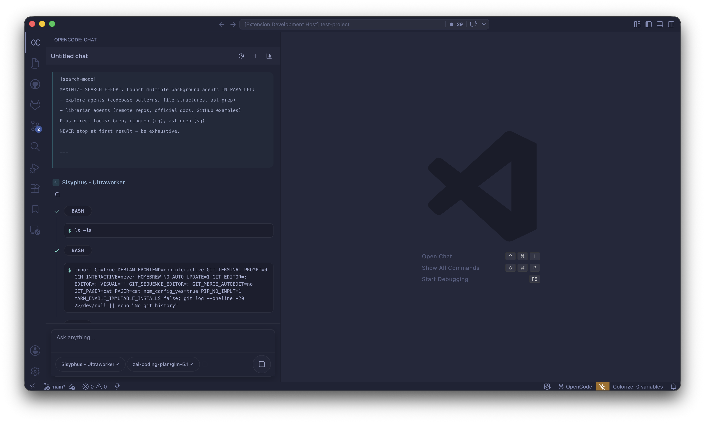

### Plan Builder and Annotations

Plan workflow from generation to review, including comments and annotations before execution.


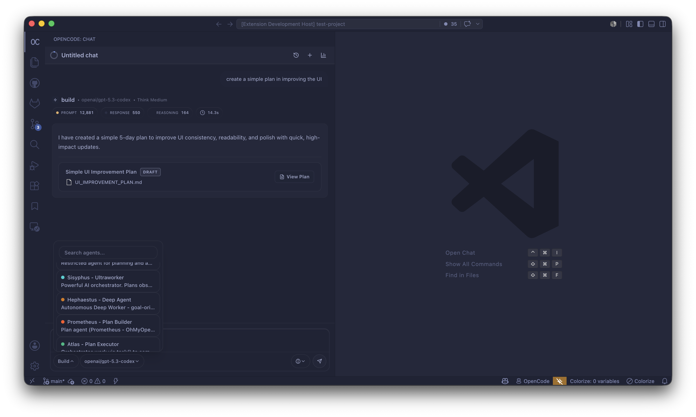
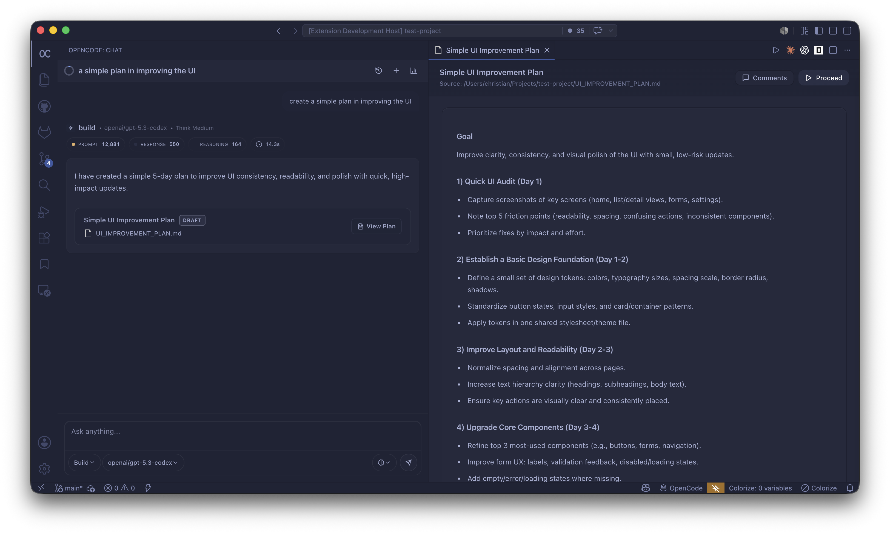
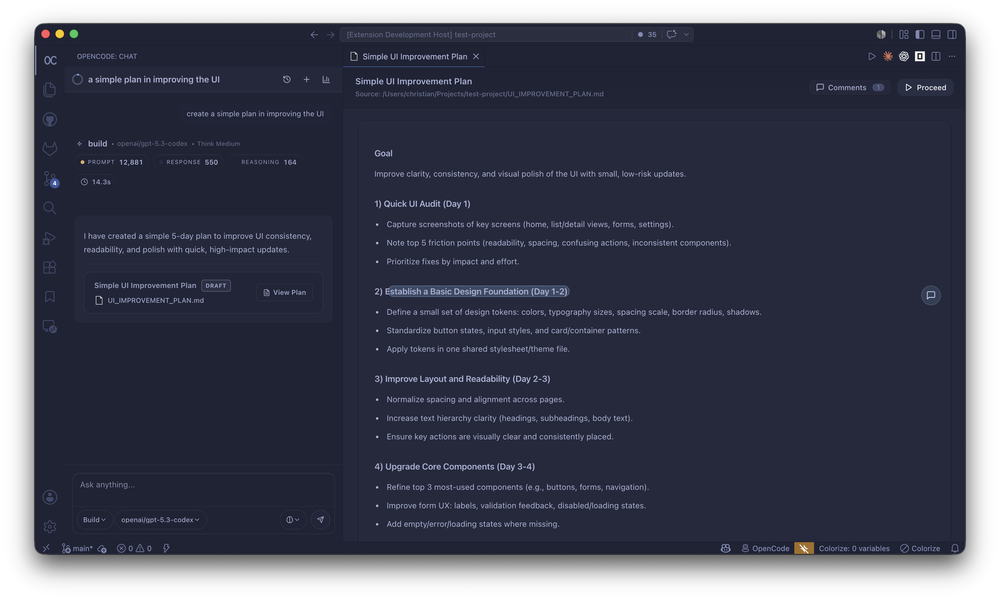
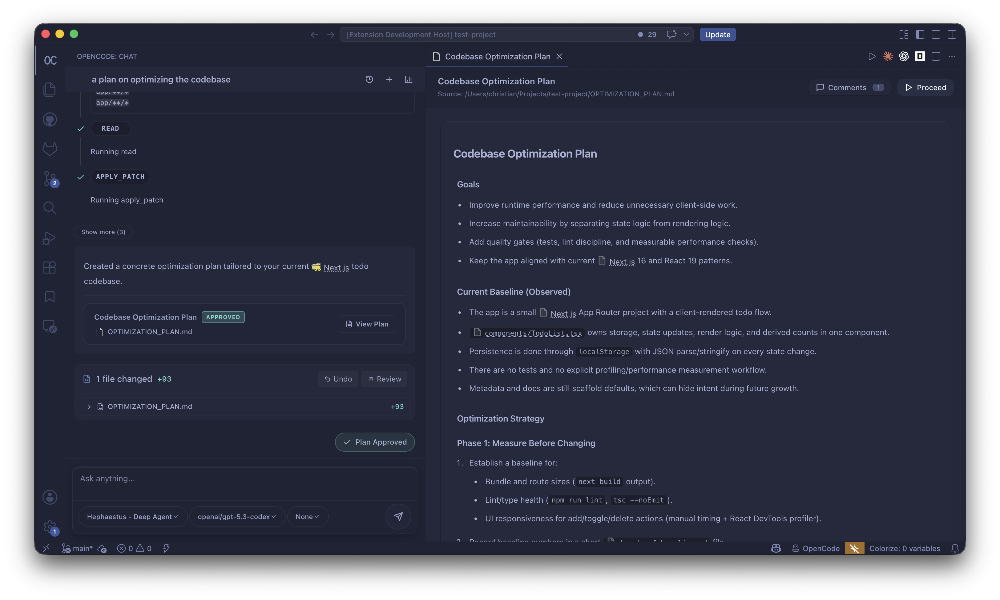
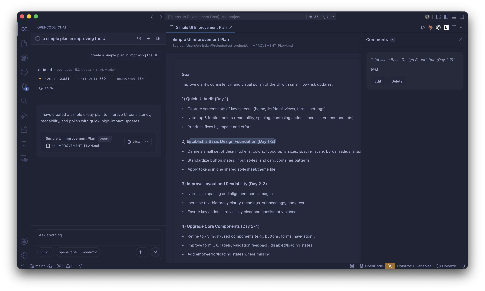
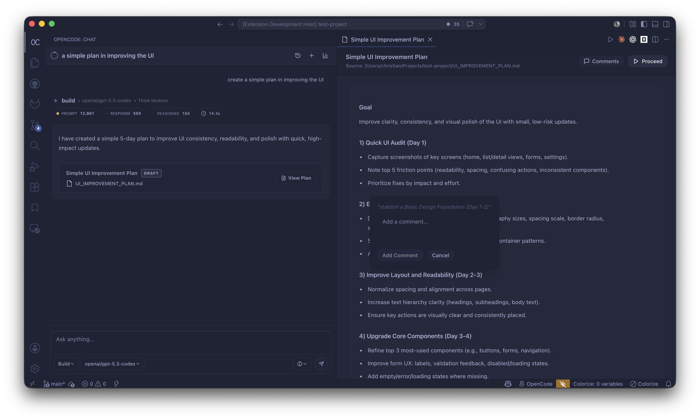

### Attachments and Code Context

Attach file references and highlighted code lines directly in the chat box.

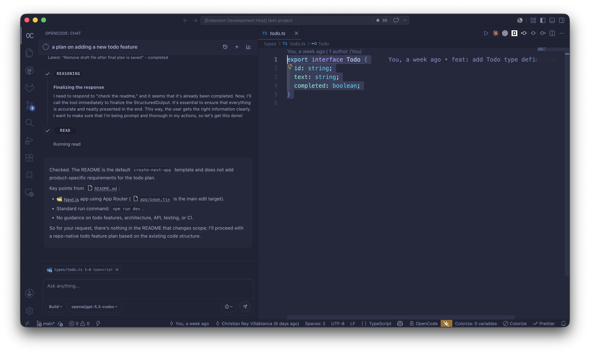

### Tasks, Subagents, and Side Panels

Agent-generated tasks, subagent activity, and side-panel visibility for active execution state.

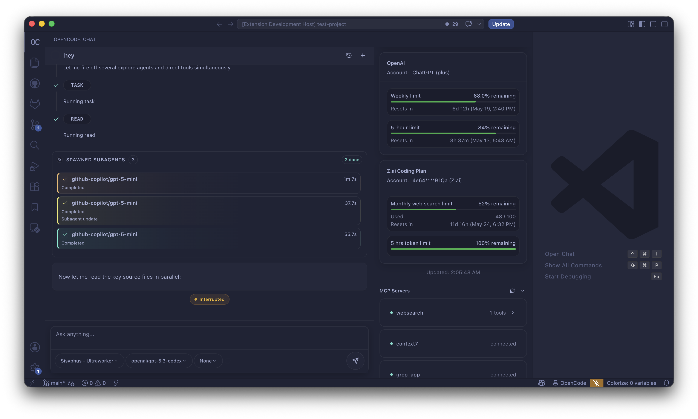
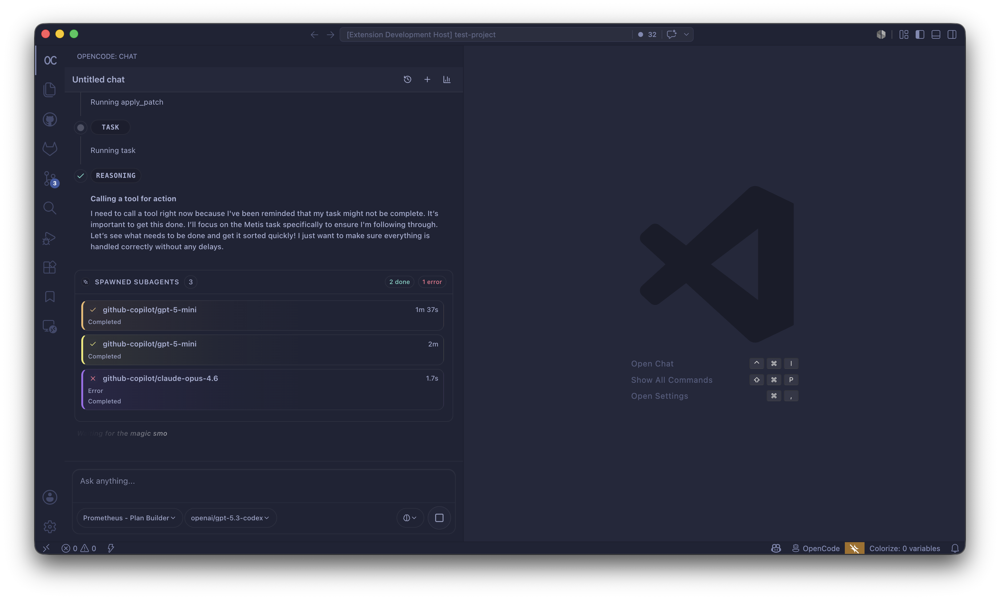
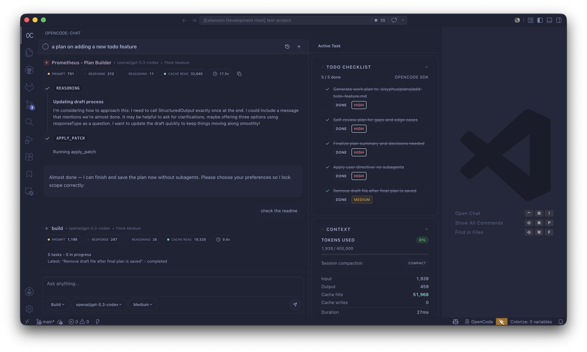

### Quota and Interactive Questions

Interactive question flow with selectable answers, custom responses, and live quota visibility.

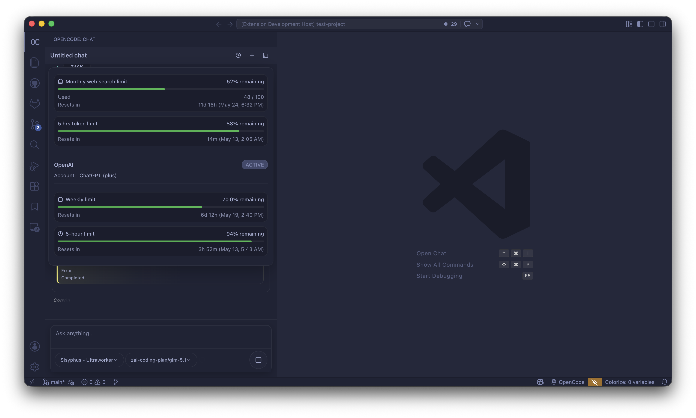
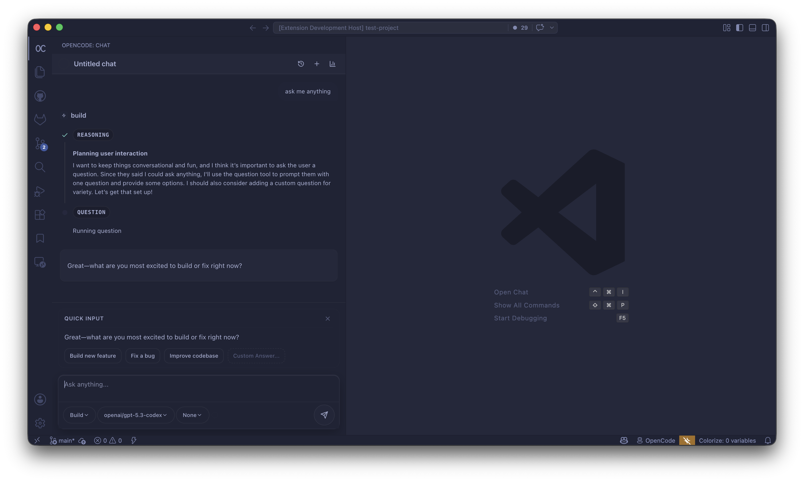
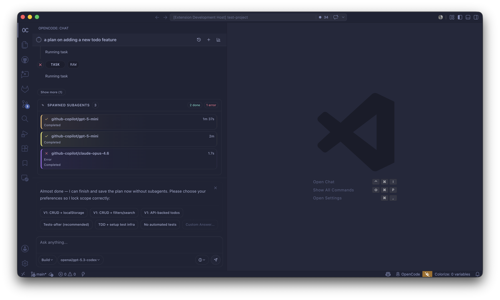
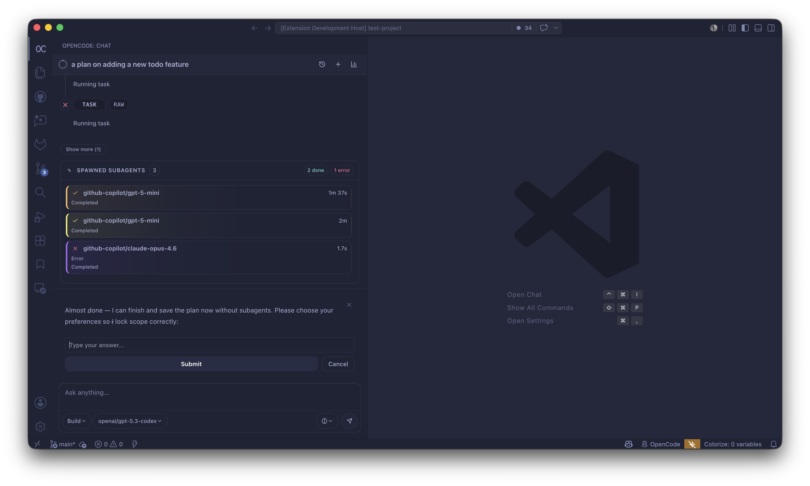

---

## Quick Start

1. Install the OpenCode CLI:

   ```bash
   curl -fsSL https://opencode.ai/install | bash
   ```

2. Install this extension in VS Code.

3. Open the OpenCode panel from the Activity Bar.

4. Start a new session and send your first prompt.

---

## Usage

### Opening the Chat Panel

| Action                | Shortcut                           |
| --------------------- | ---------------------------------- |
| Focus / open chat     | `Ctrl+Esc` / `Cmd+Esc`             |
| New session           | `Ctrl+Shift+Esc` / `Cmd+Shift+Esc` |
| Send selected code    | `Ctrl+L` / `Cmd+L`                 |
| Insert file reference | `Ctrl+Alt+K` / `Cmd+Alt+K`         |

You can also open the panel from the Activity Bar using the OpenCode icon.

### Sending a Message

Type your prompt in the chat input and press **Enter**.

Use **Shift+Enter** for a new line.

You can:

- Attach images by pasting or dragging them into the input
- Reference files with `Ctrl+Alt+K` / `Cmd+Alt+K`
- Attach selected code with `Ctrl+L` / `Cmd+L`
- Use slash commands by typing `/`
- Select an agent from the agent dropdown
- Switch between Plan, Build, and custom agents exposed by OpenCode

### Plan Mode

1. Select the **Plan** agent from the agent dropdown.
2. Describe the feature or change you want.
3. Answer any inline questions from the agent.
4. OpenCode generates an `implementation_plan.md`.
5. Click **View Implementation Plan**.
6. Review the plan.
7. Add annotations or comments.
8. Request revisions if needed.
9. Switch to Build mode or proceed with implementation.

### Managing Sessions

- Click the history icon in the chat header to open the session list.
- Sessions are listed with title, date, and token count.
- Use the session menu to rename, delete, or fork a session.

### Stopping a Response

Click the **Stop** button in the chat header to abort the current AI request.

---

## Configuration

Access settings through:

```txt
File → Preferences → Settings → OpenCode
```

or add them to `settings.json`.

### Server Settings

| Setting                           | Type      | Default  | Description                                                             |
| --------------------------------- | --------- | -------- | ----------------------------------------------------------------------- |
| `opencode.serverPort`             | `number`  | `0`      | Port for the OpenCode server. `0` auto-assigns a free port.             |
| `opencode.autoStart`              | `boolean` | `true`   | Start the server automatically when the extension activates.            |
| `opencode.persistSessions`        | `boolean` | `true`   | Persist chat sessions across VS Code restarts.                          |
| `opencode.autoCompact`            | `boolean` | `true`   | Compact a session automatically when context usage nears the threshold. |
| `opencode.autoCompactThreshold`   | `number`  | `0.9`    | Fraction of model context usage that triggers auto-compaction.          |

### Logging Settings

| Setting                          | Type      | Default   | Description                                          |
| -------------------------------- | --------- | --------- | ---------------------------------------------------- |
| `opencode.logging.level`         | `string`  | `"info"`  | Minimum log level: `error`, `warn`, `info`, `debug`. |
| `opencode.logging.enableConsole` | `boolean` | `true`    | Write logs to the VS Code Output channel.            |
| `opencode.logging.enableFile`    | `boolean` | `false`   | Write logs to a rotating file on disk.               |
| `opencode.logging.maxFileSize`   | `number`  | `5242880` | Max log file size in bytes before rotation.          |
| `opencode.logging.maxFiles`      | `number`  | `3`       | Number of backup log files to keep.                  |

### Example `settings.json`

```json
{
  "opencode.serverPort": 0,
  "opencode.autoStart": true,
  "opencode.persistSessions": true,
  "opencode.autoCompact": true,
  "opencode.autoCompactThreshold": 0.9,
  "opencode.logging.level": "debug",
  "opencode.logging.enableFile": true
}
```

---

## Architecture

```txt
┌─────────────────────────────────────────────────────────────┐
│                    VS Code Extension Host                    │
│                                                             │
│  extension.ts                                               │
│    ├── OpencodeServerManager  (manages local OpenCode server)│
│    ├── SessionService         (persistence + sync)           │
│    ├── StatusBarProvider      (connection indicator)         │
│    ├── ChatViewProvider       (main webview host)            │
│    ├── PlanViewProvider       (implementation plan viewer)   │
│    └── DiffReviewProvider     (VCS diff panel)               │
│                                                             │
│  Services                                                   │
│    ├── MessageStreamService   (SSE event streaming)          │
│    ├── SubagentTracker        (background task tracking)     │
│    ├── QuotaService           (provider quota polling)       │
│    ├── RequestBudgeter        (daily budget calculation)     │
│    ├── PlanParser             (implementation_plan.md)       │
│    └── GeminiTokenUsageTracker                              │
└────────────────────┬────────────────────────────────────────┘
                     │  HTTP + SSE via @opencode-ai/sdk
                     │  port: auto-assigned or configured
┌────────────────────▼────────────────────────────────────────┐
│                    OpenCode Local Server                     │
│                accessed via @opencode-ai/sdk                 │
│                                                             │
│  REST API                                                   │
│    GET  /agent                  — list agents                │
│    GET  /command                — list slash-command skills  │
│    GET  /mcp                    — MCP server status          │
│    GET  /lsp/status             — LSP server status          │
│    GET  /event                  — SSE event stream           │
│    POST /session/:id/prompt     — send message               │
│    ...and more session, file, tool, and VCS endpoints        │
└─────────────────────────────────────────────────────────────┘
                     │
┌────────────────────▼────────────────────────────────────────┐
│                   Webview React UI                          │
│                   webview/shared/dist/chat.js               │
│                                                             │
│  ChatShell.tsx           — layout container                  │
│  MessageComponents.tsx   — user and assistant messages       │
│  PanelComponents.tsx     — sidebar panels                    │
│  StreamingComponents.tsx — live streaming card               │
│  BudgetIndicator.tsx     — inline budget banner              │
│  SubagentDetailModal.tsx — subagent inspection modal         │
└─────────────────────────────────────────────────────────────┘
```

### Data Flow

1. User types in the chat input.
2. The webview sends a `sendPrompt` message to the extension host.
3. `ChatViewProvider` receives the message.
4. The extension calls `client.session.prompt()`.
5. `MessageStreamService` streams SSE events from the OpenCode server.
6. Events are forwarded to the webview.
7. The React reducer updates the UI in real time.

---

## Project Structure

```txt
vscode-opencode/
├── src/
│   ├── extension.ts
│   ├── providers/
│   │   ├── ChatViewProvider.ts
│   │   ├── DiffReviewProvider.ts
│   │   ├── PlanViewProvider.ts
│   │   └── StatusBarProvider.ts
│   ├── services/
│   │   ├── OpencodeServerManager.ts
│   │   ├── SessionService.ts
│   │   ├── MessageStreamService.ts
│   │   ├── SubagentTracker.ts
│   │   ├── QuotaService.ts
│   │   ├── RequestBudgeter.ts
│   │   ├── PlanParser.ts
│   │   └── GeminiTokenUsageTracker.ts
│   ├── shared/
│   ├── types/
│   └── utils/
│       └── Logger.ts
├── webview/
│   └── shared/
│       ├── src/
│       │   ├── chat/
│       │   │   ├── ChatShell.tsx
│       │   │   ├── MessageComponents.tsx
│       │   │   ├── PanelComponents.tsx
│       │   │   ├── StreamingComponents.tsx
│       │   │   ├── BudgetIndicator.tsx
│       │   │   ├── SubagentDetailModal.tsx
│       │   │   ├── ImagePreviewModal.tsx
│       │   │   └── lib/
│       │   │       ├── store.ts
│       │   │       ├── types.ts
│       │   │       ├── messageHandler.ts
│       │   │       ├── structuredOutputValidator.ts
│       │   │       └── generated/
│       │   ├── plan/
│       │   ├── diff-review/
│       │   └── components/ui/
│       └── dist/
├── scripts/
├── tests/
├── resources/
├── AGENTS.md
├── LOGGING.md
├── package.json
├── tsconfig.json
└── esbuild.config.js
```

---

## Core Services

### `OpencodeServerManager`

Starts and manages the local OpenCode server process.

Handles:

- Dynamic port allocation
- Server readiness detection
- Cross-platform process cleanup
- Automatic reconnection
- Status events for the status bar and chat provider

### `MessageStreamService`

Custom fetch-based SSE client for OpenCode events.

Handles:

- SSE line parsing
- Chunk-boundary buffering
- Request cancellation
- Subscriber management
- Auto-reconnect with back-off

### `SessionService`

Persists sessions between VS Code restarts using `context.globalState`.

It also syncs with the server on startup and reconciles sessions created externally.

### `SubagentTracker`

Parses subagent-related events and builds parent-child session relationships.

It exposes subagent summaries and details to the webview.

### `QuotaService`

Polls provider-specific quota APIs.

Supported providers include:

- OpenAI
- GitHub Copilot
- Google Gemini
- Zhipu
- Z.ai

### `RequestBudgeter`

Calculates daily request allowance based on monthly quota and days remaining in the billing cycle.

Stores usage data under:

```txt
~/.opencode/budget/
```

### `PlanParser`

Parses `implementation_plan.md` files.

Extracts:

- Goal
- Description
- File operations
- Verification steps
- Checklist items
- Completion state

---

## Webview React UI

The webview is a standalone React application bundled into:

```txt
webview/shared/dist/chat.js
webview/shared/dist/chat.css
```

It communicates with the extension host through:

```ts
vscode.postMessage(...)
window.addEventListener("message", ...)
```

### Main UI Files

| File                      | Purpose                        |
| ------------------------- | ------------------------------ |
| `ChatShell.tsx`           | Main layout container          |
| `MessageComponents.tsx`   | User and assistant messages    |
| `PanelComponents.tsx`     | Sidebar panels                 |
| `StreamingComponents.tsx` | Live streaming card            |
| `BudgetIndicator.tsx`     | Inline quota and budget banner |
| `SubagentDetailModal.tsx` | Subagent inspection modal      |

### Message Protocol

| Direction           | Type           | Purpose                     |
| ------------------- | -------------- | --------------------------- |
| Extension → Webview | `initState`    | Initial state on panel open |
| Extension → Webview | `streamEvent`  | SSE event chunk             |
| Extension → Webview | `mcpStatus`    | MCP server status           |
| Extension → Webview | `lspStatus`    | LSP server status           |
| Extension → Webview | `agentsList`   | Available agents            |
| Extension → Webview | `commandsList` | Available slash commands    |
| Extension → Webview | `quotaData`    | Provider quota data         |
| Extension → Webview | `budgetInfo`   | Daily budget data           |
| Webview → Extension | `sendPrompt`   | Send a user prompt          |
| Webview → Extension | `getMcpStatus` | Request MCP status          |
| Webview → Extension | `getLspStatus` | Request LSP status          |
| Webview → Extension | `getAgents`    | Request agents              |
| Webview → Extension | `stopRequest`  | Stop active request         |
| Webview → Extension | `newSession`   | Create new session          |

---

## Development

### Install Dependencies

```bash
npm install
```

### Build

```bash
npm run build
```

### Run in VS Code

Press **F5** to launch an Extension Development Host.

### Watch Mode

Use two terminals:

```bash
npm run watch
```

```bash
npm run webview:watch
```

During development:

- Extension code is rebuilt by esbuild.
- Webview code is rebuilt separately.
- Reload the Extension Host with `Ctrl+R` / `Cmd+R`.

---

## Structured Output Contract Sync

The JSON schema for structured AI responses is shared between the backend and webview.

Run this when changing the structured output contract:

```bash
npm run structured-output:sync
```

Verify generated files are up to date:

```bash
npm run structured-output:check
```

---

## Packaging

Install `vsce`:

```bash
npm install -g @vscode/vsce
```

Build and package:

```bash
npm run build
vsce package
```

This creates a `.vsix` file that can be installed through:

```txt
Extensions → Install from VSIX
```

---

## Publishing

Marketplace packaging uses hosted image/content URLs.

```bash
VSCE_BASE_IMAGES_URL="https://your-cdn-url.com" npm run package:marketplace
```

Publish:

```bash
VSCE_BASE_IMAGES_URL="https://your-cdn-url.com" npm run publish:marketplace
```

---

## Logging

The extension includes structured logging with correlation IDs, feature flow tracking, and performance monitoring.

### Enable File Logging

Add this to `settings.json`:

```json
{
  "opencode.logging.enableFile": true,
  "opencode.logging.level": "info"
}
```

### Analyze Logs

```bash
npm run analyze-logs:summary
npm run analyze-logs:flows
npm run analyze-logs:errors
npm run analyze-logs:perf
```

### Viewing Logs

Open:

```txt
Output → OpenCode
```

For full details, see:

```txt
LOGGING.md
```

---

## Testing

Run all tests:

```bash
npm test
```

Run a specific test file:

```bash
node --test tests/plan-parser.test.mjs
```

The test suite covers:

- Plan parsing
- Structured output validation
- Quota logic
- Subagent tracking
- Message streaming
- Session CRUD
- UI contracts
- MCP/LSP panels
- Model dropdown behavior

---

## Regression Guardrails

Install repo-managed git hooks:

```bash
npm run hooks:install
```

Run the local pre-push guard manually:

```bash
npm run guard:prepush
```

Run impacted tests only:

```bash
npm run test:impacted
```

The guard checks:

- Structured output contract
- Extension compile
- Type checking
- Linting
- Webview build when needed
- Impacted regression tests

---

## Core Feature Protection

The following features should not be silently removed or broken:

- Token usage sticky header
- View Implementation Plan button
- Stop Request button
- React webview contract
- Chat script and stylesheet loading
- Plan viewer workflow
- Session persistence
- Subagent tracking
- Quota monitor

---

## Contributing

1. Fork the repository.
2. Create a feature branch.
3. Follow the rules in `AGENTS.md`.
4. Run the required checks.
5. Open a pull request with a clear summary.

Before opening a PR, run:

```bash
npm run structured-output:check
npm test
```

---

## License

MIT

---

## Credits

Built on top of [OpenCode](https://opencode.ai) by Anomaly.
